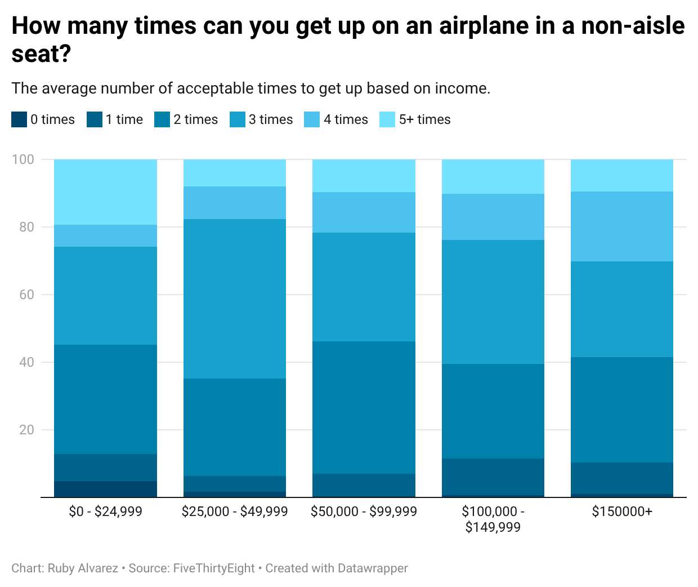

# First Class or Economy, Most Flyers Agree: Go Ahead and Recline Your Seat
By: Ruby Alvarez

# Introduction
Data was sourced from FiveThirtyEight's GitHub archive. It was generated from a self-reported survey of 1040 people. People were allowed to abstain from answering any question, leaving blanks in the data. 

# Data Analysis

## Cleaning the Data
Many column names had minor typos, which were adjusted. One of the income values. 150000 needed formatting adjustments as well. When analyzing the data via various pivot tables, most variables had to be filtered to exclude blank responses. Key categories in the data included income, gender, age, height, and various queries about what they think is considered rude on an airplane. 

## Interesting Patterns
1. One interesting pattern is that across all income brackets, most people do not mind others reclining their seats on airplanes
2. A second intriguing pattern is that, regardless of income, people agree that the sweet number of times to get up (in a non-aisle seat) is 3 times. 

## Questions to answer
What questions could the data help answer?
What interesting patterns might be found by sorting, filtering, grouping, or comparing the data?

Through filtering, grouping, and comparison, this dataset could be used to reveal what kinds of people

## Strengthening the Analysis
What additional data might be needed to make the analysis stronger?

# Data Visualization
1. A horizontal stacked bar chart was chosen to display how people across different income levels feel about reclining one's seat on a plane. The chart effectively shows that, despite income, most people feel reclining on a plane isn't rude at all. 

2. Title
   

# Conclusion
## What privacy or ethical concerns might arise from this data

Privacy concerns could arise from the wage being exposed. If there was any leak of personal information, it could be an invasion of privacy on the individuals who completed the survey. 

## Could the data harm, stigmatize, or misinterpret individuals or communities

Yes, the data, though pretty evenly distributed throughout all categories, could create harm mainly the lower-income demographic of individuals surveyed. They have the highest rate of saying that reclining your airplane seat is “very rude”. This can make headlines that can misinterpret the data as “Low-income people are pickier”. The data could also create harm to the people surveyed, who had the highest percentage of saying it is rude. That class of people has the potential to be judged based on this data and may be mistreated in the airspace and even in their communities. 

## What reporting challenges might come up
There could be issues of generalization because there 
Since the data is purely categorical, it would not allow us to make causal inferences

## What voices or sources would need to be included beyond the data
There should be smaller increments of earnings, which would increase our understanding of the hypothesis we made. 
There should be an indication of what flight class each person primarily flies in. There could be a difference in a person's idea of whether it is rude to recline your seat in an airplane, between someone who is flying in first class and someone who is in the general admission seats, regarding leg space. There should be a part of the data set that gives space for the participant to give the analyst an understanding of what their personal space values are like. This would make the data have more value because we can analyze human psychology more than a blanket statement. 

## Ethical Considerations
